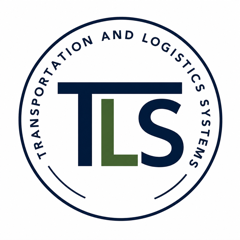

<div class="page-title-with-logo">

<h1>Transportation and Logistics Systems Lab</h1>
</div>

::: {.hero}
::: {.hero-text}
<div class="hero-eyebrow">Welcome to our Reserach Lab!</div>

# Usman Ahmed

<div class="hero-role">Research Assistant Professor</div>
<div class="hero-affiliation"><a href="https://utorii.com/usman-ahmed/" target="_blank">UT-Oak Ridge Innovation Institute</a><br><a href="https://ctr.utk.edu/person/usman-ahmed/" target="_blank">Center for Transportation Research</a><br>University of Tennessee, Knoxville</div>

<div class="hero-role">Chief Development Officer</div>
<div class="hero-affiliation"><a href="https://apex-ai.site" target="_blank">Apex AI</a></div>

<div class="hero-interests">

Dr. Usman Ahmed is a Research Assistant Professor at the UT-Oak Ridge Innovation Institute (UTORII), University of Tennessee, Knoxville. Dr. Ahmed's research interests include supply chain and logistics, transportation demand modeling, emerging freight technologies for last-mile delivery, e-commerce modeling, and digital twins for transportation. His work integrates optimization, econometric modeling, simulation, computer vision, artificial intelligence, and machine learning to develop data-driven solutions that improve the efficiency, resilience, and sustainability of transportation and logistics systems.

</div>

<div class="hero-actions">
<a class="btn-line btn-solid" href="https://www.linkedin.com/in/uahmed16" target="_blank">LinkedIn</a>

<a class="btn-line btn-solid" href="https://apex-ai.site" target="_blank">Apex AI</a>

<a class="btn-line btn-solid" href="https://scholar.google.com/citations?user=eiM9m1EAAAAJ&hl=en&oi=ao" target="_blank">Google Scholar</a>

<!--
<a class="btn-line btn-solid" href="https://ctr.utk.edu/person/usman-ahmed/" target="_blank">CTR Profile</a>

<a class="btn-line btn-solid" href="https://utorii.com/usman-ahmed/" target="_blank">UTORII Profile</a>
-->


</div>
:::


:::


<hr class="rule">


::: {.page-section}
<div class="section-head">
<div class="section-label">Planning and Scenario Analysis Tools</div>
<a class="view-all" href="modeling-tools.qmd">All tools &rarr;</a>
</div>

### [Microhub and Cargo Cycle Planning Tool](modeling-tools.qmd#microhub-and-electric-cargo-cycle-planning-tool)

::: {.tool-showcase}
::: {.tool-showcase-details}
1. **Microhub Sizing**: Estimates the number of microhubs required to serve the study
   area.
2. **Location Selection**: Identifies optimal microhub locations.
3. **Service Area Assignment**: Assigns service areas to microhubs.
4. **Fleet & Route Sizing**: Calculates the number of e-cargo cycles required at each microhub and the total tour distance.
:::

::: {.tool-showcase-media}
```{=html}
<video controls style="max-width:100%;" preload="metadata" poster="images/microhubs-thumb.jpg">
<source src="videos/microhubs_demo.mp4" type="video/mp4">
Your browser does not support the video tag.
</video>
```
:::
:::

### [Tennessee Highway Incident Analysis](modeling-tools.qmd#tennessee-highway-incident-analysis)

::: {.tool-showcase}
::: {.tool-showcase-details}
1. **Hotspot Analysis**: Identifies locations with elevated incident concentration across
   the highway network.
2. **Incident Severity Modeling**: Estimates the likely severity of incidents based on
   roadway and traffic conditions.
3. **Incident Clearance Time Modeling**: Predicts how long it will take to clear an
   incident from the roadway.
4. **Scenario Analysis**: Compares predicted incident severity and clearance time across
   different scenarios.
:::

::: {.tool-showcase-media}
```{=html}
<div class="tool-ribbon-card">
<h4>Highway Incident Analytics</h4>
<p>Analyze highway incident data across Tennessee to uncover patterns, predict hotspots, and support data-driven safety and infrastructure decisions.</p>
<a class="tool-ribbon-link" href="https://titan.motionintel.ai">Open Titan &rarr;</a>
</div>
```
:::
:::
:::

<hr class="rule">

::: {.page-section}
<div class="section-head">
<div class="section-label">Latest News</div>
<a class="view-all" href="news.qmd">All news &rarr;</a>
</div>


:::

<!--
::: {.page-section}
<div class="section-head">
<div class="section-label">Research Areas</div>
</div>

::: {.plain-grid}
<div>
### Traffic Flow & Control
Modeling and controlling traffic dynamics on freeways and arterials, including signal
timing and mixed human/automated traffic.
</div>
<div>
### Transportation Safety
Statistical and machine-learning methods for crash prediction and proactive safety
management.
</div>
<div>
### Connected & Automated Vehicles
Evaluating how CV/AV technologies affect network performance and safety during the
transition period.
</div>
<div>
### Transit Equity
Measuring and improving access to public transit for underserved populations.
</div>
:::

[View all research areas &rarr;](research.qmd)
:::

<hr class="rule">

::: {.page-section}
<div class="section-head">
<div class="section-label">Featured Projects</div>
<a class="view-all" href="projects.qmd">All projects &rarr;</a>
</div>


:::

<hr class="rule">


::: {.page-section}
<div class="section-head">
<div class="section-label">Recent Publications</div>
<a class="view-all" href="publications.qmd">All publications &rarr;</a>
</div>


:::

<hr class="rule">
-->
